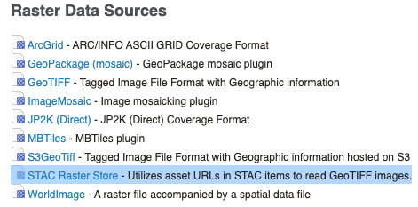
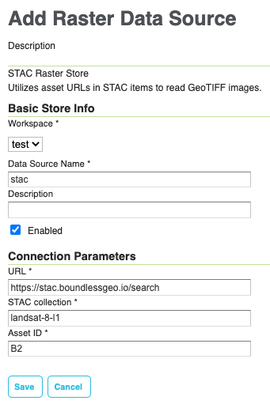
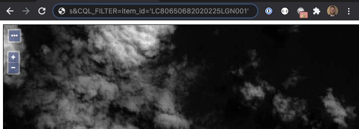

# stac-gt-datastore

The STAC GeoTools Raster Store project aims to make it easy to render your STAC assets in an OGC compliant fashion 
with minimal configuration and set up.  

## Setup

### Create the Store
The store configuration is extremely simple.  From the GeoServer admin UI, click "Add Store".  Under "Raster Data Sources", 
click "STAC Raster Store".

In the store configuration page, you only need to point to the search endpoint of your STAC API service, specify the 
collection you wish to use, and the asset ID you wish to render.

### Publish the Layer

Once the store has been created, you can publish the layer in the same manner you would publish any GeoServer layer.  
No special steps are required at this point and you are free to apply any configuration you desire.

### Look at Pictures

In any OGC request where the [CQL_FILTER vendor parameter](https://docs.geoserver.org/stable/en/user/services/wms/vendor.html#wms-vendor-parameters) 
is supported, you can apply the filter:

`&CQL_FILTER=item_id='<stac_item_id>'`

Note: if testing in a browser, make sure you paste in the right bbox for the given item!

## Limitations

* This version of the store was created and released on a very short time frame and currently only supports the s3-geotiff 
reader from GeoTools. In its current state, this can easily be expanded to support a gambit of GeoTools readers.
* Also note that in it's current state, it's hard-coded to build s3 URLs to us-west-2, which is where the landsat 8
imagery used for the STAC demo is located.  This URL building is very hacky and static, as it was only built for the 
purposes of this demo. Instead of investing a lot of time into smartly building s3 urls, I've decided to just wait 
until the COG reader is released.  Anybody wanting to invest time into this effort is more than welcome to submit a PR.
* The imagery in the collection is assumed to be in a homogenous CRS. If an attempt is made to render an image from the 
collection and that image is in a different CRS from the image used to create the store, an error will be generated. 

## Future Work

My original intent for this store was to use the [COG reader I built for imageio-ext](https://github.com/geosolutions-it/imageio-ext/tree/master/plugin/cog/cog-streams/src/main/java/it/geosolutions/imageioimpl/plugins/cog). 
This reader supports COG reads, tile caching, and can read from any http endpoint.  In addition, it can be expanded to 
use custom readers, allowing devs to tap into any remote source or API to read byte streams.

While my focus for this project has been on COGs, as previously stated, the project can easily be expanded to include 
logic to instantiate the appropriate readers for any image format.

## Useful Links

### Staccato
An open-source STAC implementation using Spring Boot and Elasticsearch  

https://github.com/planetlabs/staccato

### Stratus
An open-source Spring Boot application that turns GeoServer into a stateless, scalable, web-native service.  

https://github.com/planetlabs/stratus

### ImageIO-Ext COG Reader Plugin
ImageIO-Ext is what GeoTools uses to read images.  A recent addition will allow GeoServer to fully take advantage of 
Cloud Optimized GeoTIFFs, but can be used independently of the GeoTools/GeoServer ecosystem.

https://github.com/geosolutions-it/imageio-ext/tree/master/plugin/cog

### STAC Image Mosaic Store
Probably needs a little love to be totally current, and also waiting on the COG release, this project will allow you 
to pass through STAC query filters to GeoServer, query a dynamic STAC catalog for all matching results, then implement 
a custom algorithm to select the final images to be mosaicked together.  This store works best out of the box when using 
images that don't overlap OR fully overlap, however it could be expanded to have more complicated item selection algorithms 
to handle complex item selection for other use cases.

https://github.com/joshfix/imagemosaic-stac# stac-raster-store
